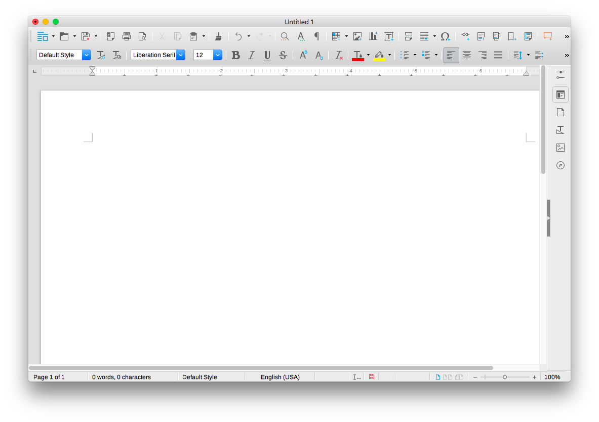
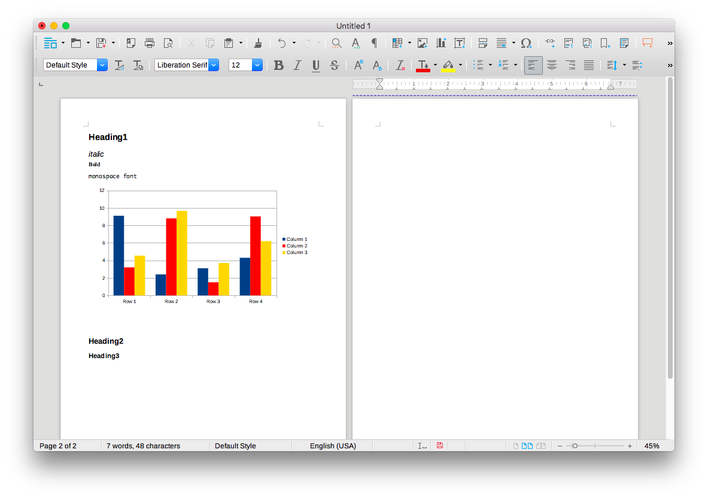
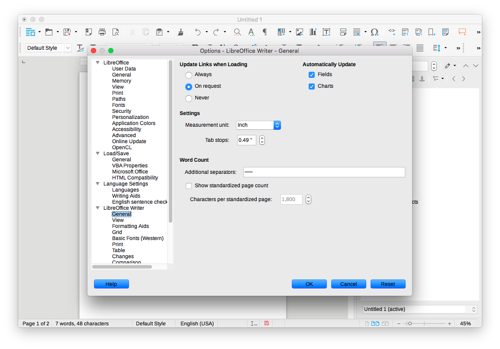
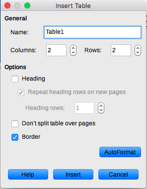

= Markup editor: Rešerše + Hi-Fi prototyp
Šmolík Jaroslav, Uhnák Peter, Špak Maroš, Chmelař Petr
Semestrální projekt MI-NUR
:icons: font
:toc:

include::_about.adoc[]

=== Autoři
 *Šmolík Jaroslav* (vedoucí týmu)::
    * mailto:smolijar@fit.cvut.cz[]
    * TODO co delal
 Uhnák Peter::
    * mailto:uhnakpet@fit.cvut.cz[]
    * TODO co delal
 Špak Maroš::
    * mailto:spakmaro@fit.cvut.cz[]
    * TODO co delal
 Chmelař Petr::
    * mailto:chmelpe7@fit.cvut.cz[]
    * TODO co delal

== Rešerše konkurence

=== Acme editor (example)

Short description. link:+http://acme.com+[Acme editor]

==== Porovnání rozdílů
Contrast of the Acme editor, compared to Markup Editor.
e.g. Acme editor is a desktop app and not web component;
or Acme editor is only Markdown editor and does not handle other LMLs;
or Acme editor is WYSIWYG and requires extensive mouse usage etc.

==== Zajímavé features
Optional intro.
Focus on cool features or features that stand out, compared to other products.

. outstanding feature a
+
Optional description
. outstanding feature b

==== Zhodnocení UI
Discuss interesting (both good and bad) features of UI.
Inlcude screenshots, comment, explain why good/bad, optionally suggest improvement.

==== Pozorování UI v kontextu markup-editor
Are there some UI elements we have as well?
Do they look similiar and provide similliar interaction?
If not, focus on those elements and briefly sum up differences.
The existing projects might (do not have to though) better (more conventional, user tested) implementation of UI elements.
Is there something we should consider for our UI?
(Have a look at things like status bar, command palette, common shortcuts, toolbar, image/table manipulation, etc.)

===== UI feature 1

.Image caption
image::http://www.tidy-mind.com/wp-content/uploads/2013/06/2013-06-25_142513-624x459.png[]

Feature description

==== Shrnutí

===== Plusy
. Plus A
+
Optional description
. Plus B

===== Mínusy
. Minus A
. Minus B

=== LibreOffice Writer
LibreOffice Writer je multiplatformový textový preprocesor z open-source kancelárského balíka LibreOffice.  

link:+https://www.libreoffice.org/discover/writer/+[https://www.libreoffice.org/discover/writer/]

==== Porovnání rozdílů
* Nejedná sa webovú komponentu, ale o desktopovú aplikáciu
* Dokumenty nie je možné písať v LML (Lightweight Markup Language)
* Zameraný na netechnických užívateľov, nezobrazuje čísla riadkov, nemá syntax highlighting
* Ponúka široké možnosti pre prácu s dokumentami (šablóny, generovanie obsahu, práca so bibliografiou,...)
* Viac možností štýlovania dokumentu (typ, farba, ľubovoľná veľkosť písma, farba zvýraznenia, line spacing, rôzne zarovnanie textu) 
* Neobsahuje command palletu, všetka funkcionalita je umiestnená v toolbari a menu.
* Nemá klasickú outline, funkcionalitu zastupuje panel _Navigator_ 
* Obsahuje dialogy pre vkladanie tabuliek, obrázkov, grafov, audia, videa
* Podpora doplnkov

==== Zhodnocení UI

===== Základní UI po instalaci
* Jedno okno s toolbarmi v hornej časti
* Postranný panel, do ktorého je možné pridávať ďalšie nástroje
* V dolnej časti okna je umiestnený  statusbar

===== Sidebar
* UI s aktívnym sidebarom s nástrojmi na formatovanie textu a nástrojom _Navigator_ 

image:2/writer-sidebar.png[]

===== Režim zobrazenia multipage
* Podporuje zobrazenie stránok dokumentu vedľa seba, počet takto zobrazených stránok sa mení automaticky v závislosti od veľkosti okna a úrovne zoomu

===== Nastavenia
* Okno s nastaveniami je možné vyvolať cez menu alebo klávesovú skratku
* Nasavenia sú rozdelené do hierarchickej štruktúry

==== Pozorování UI v kontextu markup-editor

* Toolbar
** Zahŕňa veľké množstvo funkcionality priamo súvisiacej s formatovaním textu (buttony pre bold, italic, underline, horný/dolný index, farba, zvýraznenie textu, zarovnanie textu, vloženie obrázkov,...)

* Statusbar
** V dolnej časti okna je statusbar s informáciou o počte strán, slov, znakov, zvolenom štýle, jazyku slovníka, indikáciou neuložených zmien v dokumente, zvoleným režimom zobrazenia a zoom levelom

* Práca s tabuľkami/obrázkami...
** Pri vkladaní obrázku/audia/videa sa zobrazí natívny dialog pre výber súboru
** Vloženie grafu priamo vloží ukažkový graf, ktorý je následne možné upraviť (zmeniť typ grafu, zdrojové data)
** Vkladanie tvarov (trojuholníky, šípky, bubliny...) kliknutím a ťahaním (pre zvolenie požadovanej veľkosti útvaru)
** Pri tabuľkách možnosť zvoliť jej veľkosť a základne nastavenia v dialogovom okne

* Outline
** Funkcionalita zastupená panelom _Navigator_ v ktorom je možné prechádzať hierachickú štruktúru dokumentu
** Po kliknutí na prvok v hierarchii sa dokument odscrolluje na potrebnú pozíciu.

* Command Pallete
** Neobsahuje
** Ovladanie myšou výberom funkcie z toolbaru/menu alebo klávesovými skratkami 

==== Zajímavé features
* Vkladanie grafov, videa, audia
* Programovateľné makra
* Preusporiadanie/presúvanie toolbarov/panelov
* Práca s bibliografiou
* Vkladanie matematických výrazov vyklikávanim v editore
* Nastavenie hlavičky, patičky stránok
* Prepracovaný spellchecker

==== Shrnutí

===== Plusy
* Vhodný aj pre netechnických užívateľov
* Tvorba komplexných dokumentov
* Množstvo pluginov
* Export dokumentu do množstva formátov (odt, doc, docx, pdf, rtf, ott, html) 
* Prepojenie s ďalšími nástrojmi z LibreOffice balíka

===== Mínusy
* Relatívne pomalý štart programu
* Uživateľsky neprivetivé zatváranie panelov
* Nie je možné vkladať obrázku/audia/videa z URL, iba z filesystemu

== Hi-fi prototyp
