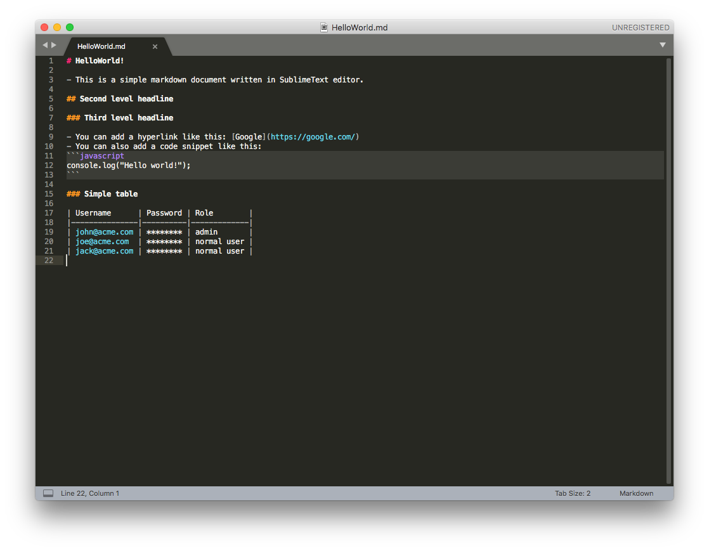
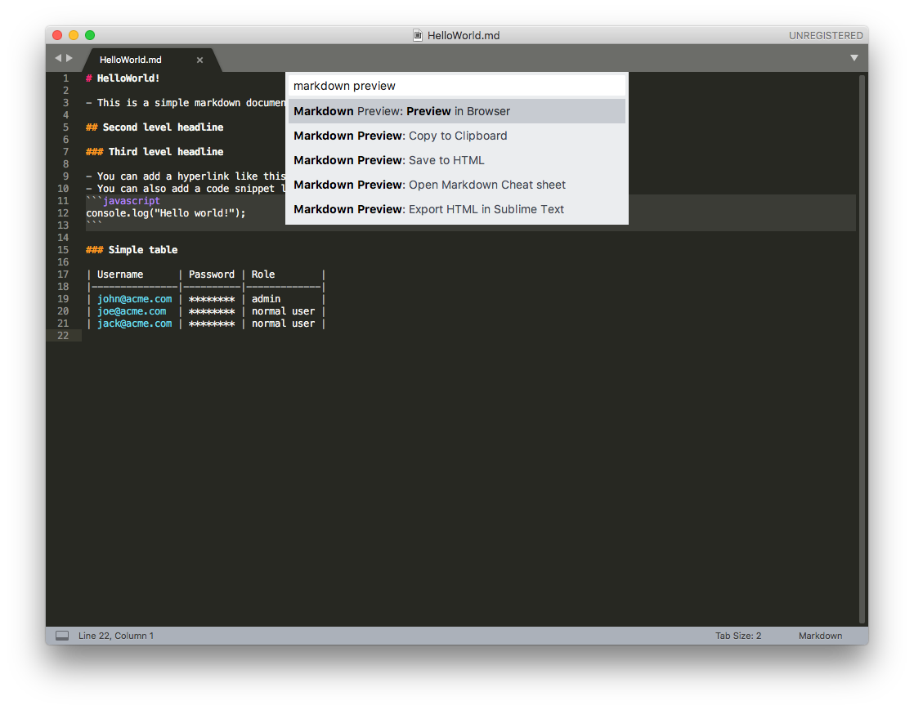
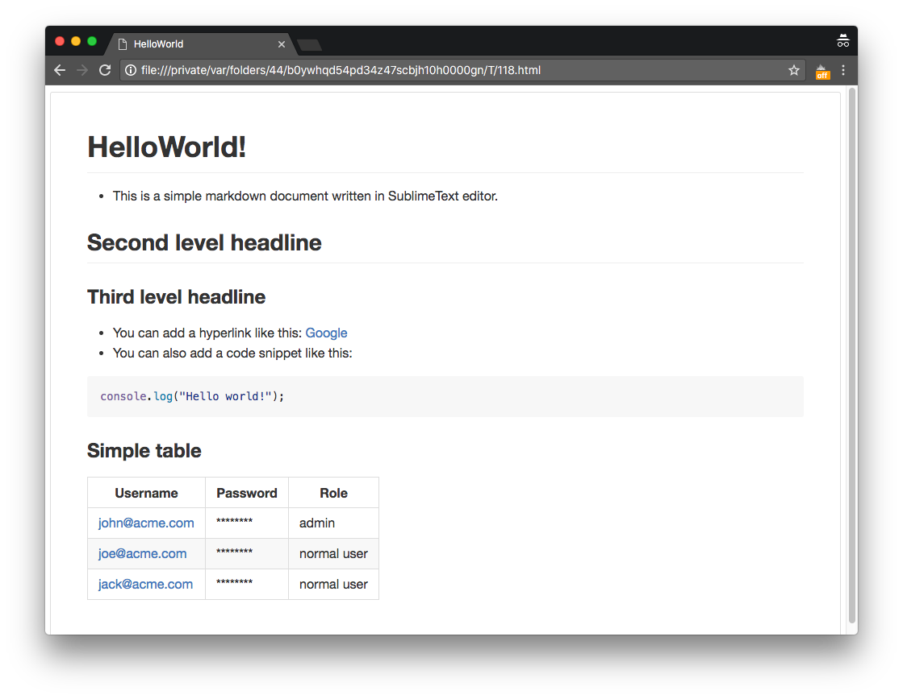
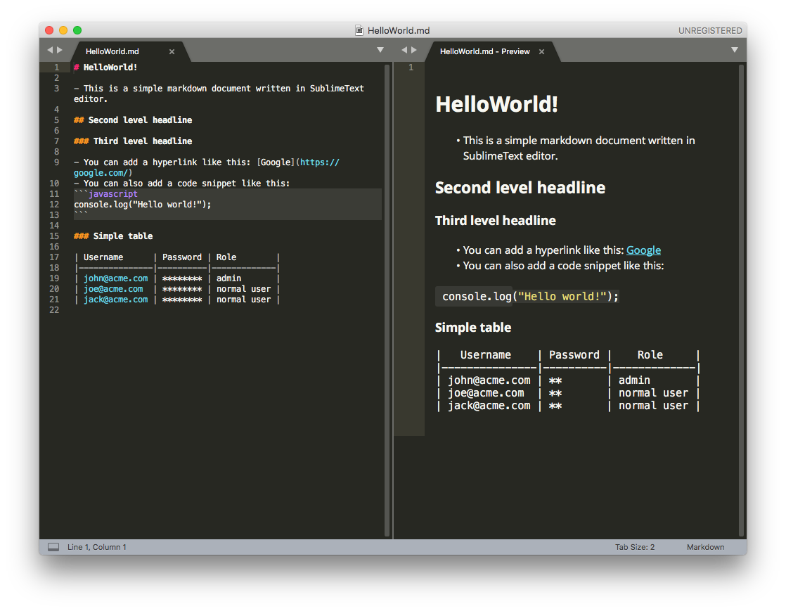
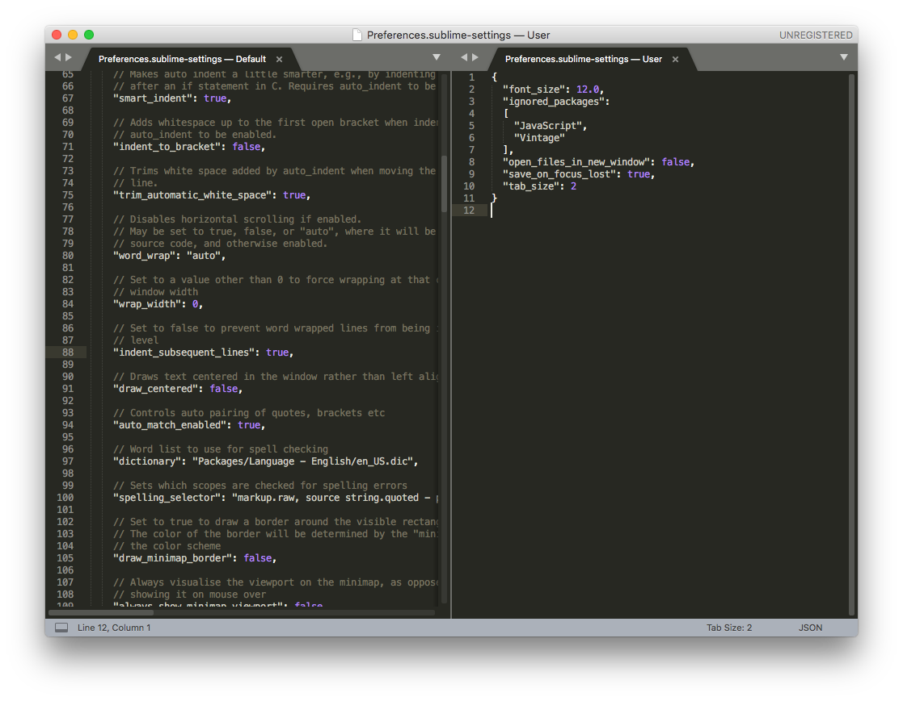
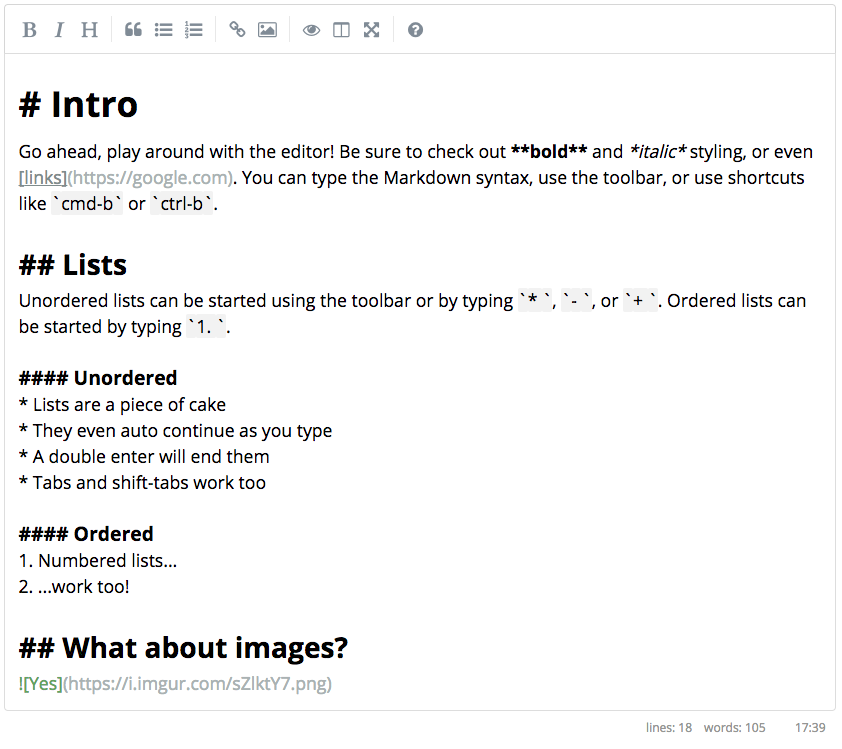
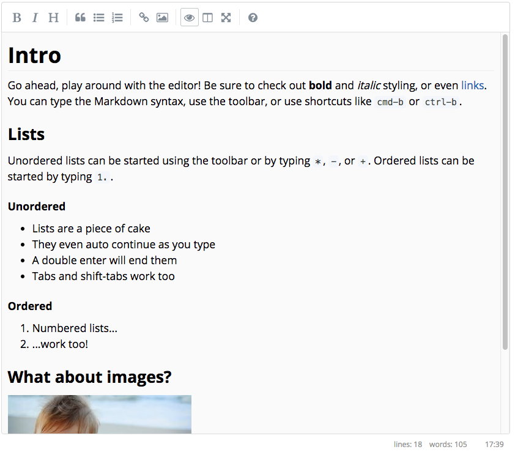

= Markup editor: Rešerše + Hi-Fi prototyp
Šmolík Jaroslav, Uhnák Peter, Špak Maroš, Chmelař Petr
Semestrální projekt MI-NUR
:icons: font
:toc:

include::_about.adoc[]

=== Autoři
 *Šmolík Jaroslav* (vedoucí týmu)::
    * mailto:smolijar@fit.cvut.cz[]
    * Prototyp, návrh osnovy rešerší, sekce implementace, review všech rešerší
 Uhnák Peter::
    * mailto:uhnakpet@fit.cvut.cz[]
    * Rešerše (GitBook, Ace), review všech rešerší
 Špak Maroš::
    * mailto:spakmaro@fit.cvut.cz[]
    * Rešerše (Typora, AsciidocLive, LibreOffice Writer)
 Chmelař Petr::
    * mailto:chmelpe7@fit.cvut.cz[]
    * Rešerše (SublimeText, SimpleMDE), review rešerší GitBook, Ace

== Rešerše konkurence

=== Acme editor (example)

Short description. link:++http://acme.com++[Acme editor]

==== Porovnání rozdílů
Contrast of the Acme editor, compared to Markup Editor.
e.g. Acme editor is a desktop app and not web component;
or Acme editor is only Markdown editor and does not handle other LMLs;
or Acme editor is WYSIWYG and requires extensive mouse usage etc.

==== Zajímavé features
Optional intro.
Focus on cool features or features that stand out, compared to other products.

. outstanding feature a
+
Optional description
. outstanding feature b

==== Zhodnocení UI
Discuss interesting (both good and bad) features of UI.
Inlcude screenshots, comment, explain why good/bad, optionally suggest improvement.

==== Pozorování UI v kontextu markup-editor
Are there some UI elements we have as well?
Do they look similiar and provide similliar interaction?
If not, focus on those elements and briefly sum up differences.
The existing projects might (do not have to though) better (more conventional, user tested) implementation of UI elements.
Is there something we should consider for our UI?
(Have a look at things like status bar, command palette, common shortcuts, toolbar, image/table manipulation, etc.)

===== UI feature 1

.Image caption
image::http://www.tidy-mind.com/wp-content/uploads/2013/06/2013-06-25_142513-624x459.png[]

Feature description

==== Shrnutí

===== Plusy
. Plus A
+
Optional description
. Plus B

===== Mínusy
. Minus A
. Minus B

=== LibreOffice Writer
LibreOffice Writer je multiplatformový textový preprocesor z open-source kancelárského balíka LibreOffice.

Samozrejme sa nejedná o priamého konkurenta nami navrhovaného markup editoru, ale myslíme, že v tvorbe obsahovo orientovaných dokumentov majú kancelárske nátroje silné zastúpenie a je teda vhodné sa o nich zmieniť.

link:+https://www.libreoffice.org/discover/writer/+[https://www.libreoffice.org/discover/writer/]

==== Porovnání rozdílů
* Nejedná sa webovú komponentu, ale o desktopovú aplikáciu
* Dokumenty nie je možné písať v LML (Lightweight Markup Language)
* Zameraný na netechnických užívateľov, nezobrazuje čísla riadkov, nemá syntax highlighting snippetov zdrojového kódu
* Ponúka široké možnosti pre prácu s dokumentami (šablóny, generovanie obsahu, práca so bibliografiou,...)
* Viac možností štýlovania dokumentu (typ, farba, ľubovoľná veľkosť písma, farba zvýraznenia, line spacing, rôzne zarovnanie textu) 
* Neobsahuje command palletu, všetka funkcionalita je umiestnená v toolbaroch a menu.
* Nemá klasickú outline, funkcionalitu zastupuje panel _Navigator_ 
* Obsahuje dialogy pre vkladanie tabuliek, obrázkov, grafov, audia, videa
* Podpora doplnkov

==== Zhodnocení UI

===== Základní UI po instalaci
* Jedno okno s toolbarmi v hornej časti
* Postranný panel, do ktorého je možné pridávať ďalšie nástroje
* V dolnej časti okna je umiestnený  statusbar

image:2/writer-zakladne-ui.png[]

===== Sidebar
* UI s aktívnym sidebarom s nástrojmi na formatovanie textu a nástrojom _Navigator_ 

image:2/writer-sidebar.png[]

===== Režim zobrazenia multipage
* Podporuje zobrazenie stránok dokumentu vedľa seba, počet takto zobrazených stránok sa mení automaticky v závislosti od veľkosti okna a úrovne zoomu

image:2/writer-multipage.png[]

===== Nastavenia
* Okno s nastaveniami je možné vyvolať cez menu alebo klávesovú skratku
* Nasavenia sú rozdelené do hierarchickej štruktúry

image:2/writer-settings.png[]

==== Pozorování UI v kontextu markup-editor

* Toolbar
** Zahŕňa veľké množstvo funkcionality priamo súvisiacej s formatovaním textu (buttony pre bold, italic, underline, horný/dolný index, farba, zvýraznenie textu, zarovnanie textu, vloženie obrázkov,...)

* Statusbar
** V dolnej časti okna je statusbar s informáciou o počte strán, slov, znakov, zvolenom štýle, jazyku slovníka, indikáciou neuložených zmien v dokumente, zvoleným režimom zobrazenia a zoom levelom

* Práca s tabuľkami/obrázkami...
** Pri vkladaní obrázku/audia/videa sa zobrazí natívny dialog pre výber súboru
** Vloženie grafu priamo vloží ukažkový graf, ktorý je následne možné upraviť (zmeniť typ grafu, zdrojové data)
** Vkladanie tvarov (trojuholníky, šípky, bubliny...) kliknutím a ťahaním (pre zvolenie požadovanej veľkosti útvaru)
** Pri tabuľkách možnosť zvoliť jej veľkosť a základne nastavenia v dialogovom okne

image:2/writer-table.png[]

* Outline
** Funkcionalita zastupená panelom _Navigator_ v ktorom je možné prechádzať hierachickú štruktúru dokumentu
** Po kliknutí na prvok v hierarchii sa dokument odscrolluje na potrebnú pozíciu.

* Command Pallete
** Neobsahuje
** Ovladanie myšou výberom funkcie z toolbaru/menu alebo klávesovými skratkami 

==== Zajímavé features
* Vkladanie grafov, videa, audia
* Programovateľné makra
* Preusporiadanie/presúvanie toolbarov/panelov
* Práca s bibliografiou
* Vkladanie matematických výrazov vyklikávanim v editore
* Nastavenie hlavičky, patičky stránok
* Prepracovaný spellchecker

==== Shrnutí

===== Plusy
* Vhodný aj pre netechnických užívateľov
* Tvorba komplexných dokumentov
* Množstvo pluginov
* Export dokumentu do množstva formátov (odt, doc, docx, pdf, rtf, ott, html) 
* Prepojenie s ďalšími nástrojmi z LibreOffice balíka

===== Mínusy
* Relatívne pomalý štart programu
* Uživateľsky neprivetivé zatváranie panelov
* V dialogu na vkladanie obrázku chýba možnosť vložiť URL (workaround cez copy/paste, drag&drop)

=== GitBook

Desktopový (free) a online (placený) editor pro markupové dokumenty ve formátu GFM (GitHub Flavored Markdown) a AsciiDoc.

Navíc k editaci dokumentů umožňuje správu celých knih, resp. používá metaforu knihy na rozdělení projektu do kapitol, případně do souborů.

Na pozadí GitBook verzuje dokumenty pomocí gitu. Prohlížení změn dokumentu je tak pohled nad git commity.

link:++https://www.gitbook.com/editor++[GitBook]

==== Porovnání rozdílů

. GitBook je stand-alone produkt - jak desktopová, tak webová verze. Nelze jej tudíž embedovat do jiných stránek.
. Neobsahuje command palette, místo toho má markdown paletu pro vkládání základních markupových konstruktů.
* GitBook umožňuje kód editovat nejen v source+preview módu, ale i jako WYSIWYG.
. Obsahuje dialog pro vkládání obrázků, které lze načítat z lokální knihovny, disku, či vzdálené adresy

==== Zhodnocení UI

===== Základní pohled

image:/assets/zakladni-ui.png[]

Základní UI zobrazuje ve své horní části toolbar, konfiguraci verzí a markdown paletu.
Zbytek okna pak zabírá sidebar s obsahem (_TOC_) nebo adresářovou strukturou (_FILES_), a konečně editorem samotným.

Ve výchozím módu je editor v módu WYSIWYG, tedy lze přímo psát do naformátovaného textu a využívat markup palety a klávesových zkratek.

===== Editace markupu

Pro přímou editaci markupu musíme kliknout na nenápadný otazníček v pravém dolním rohu a zvolit _Edit Markdown_. Stejným způsobem se můžeme vrátit k WISIWYGu.
Při editaci zdroje se hlavní část UI rozdělí na zdroj a preview (lze vypnout v konfiguraci).

image:/assets/editace-markup.png[]

Nutno podotknout, že mód WYSIWYGu je dostupný pouze pro Markdown, ačkoliv GitBook podporuje i AsciiDoc. AsciiDoc je vždy v módu editace zdroje.
Preview okno je opravdu jenom preview, a nelze v něm editovat text. Toto považuji za škodu; když už GitBook podporuje WYSIWYG, bylo by zajímavé mít v jedné polovině editovatelný zdrojový kód, a v pravé polovině editovatelný WISIWYG.

===== Scrollování

Co je určitě nedostatkem preview je nemožnost odscrollování zdroje na správnou pozici když na něco kliknu v preview. Rovněž synchronizované scrollování funguje pouze při scrollování zdroje, nikoliv preview. U dokumentů s obrázky (kde je preview mnohem delší než markup) je navíc vidět, že "synchronizace" je implementována hloupou interpolací, kdy obě okna scrollují o stejné relativní množství. Je tedy možné být odscrollovaný na markup a editovat jej bez možnosti vidět preview. Jako bonus scrollování nejde vypnout.

===== Vyhledávání v textu

**Editor postrádá jakoukoliv možnost vyhledávání v textu!**

===== Markup paleta a zkratky

Markupová paleta je dostupná jednak v pravé horní části obrazovky, a jednak v horním menu pod "Markup". Chování je ale velmi nekonzistentní obecně, a také mezi WYSIWYGem a markup editorem.

Ve WYSIWYG módu se některé zkratky/položky chovají podle očekávání, např. bold (nebo ctrl+b) přepne bold na označeném textu. Jiné se však chovají překvapivě.

Pro příklad uvedu případ _Numbered List_ a _Bulleted List_.

Při kliknutí na ikonku Numbered list (v markup paletě), text pod kurzorem se změní na číslovaný seznam. Pokud na tlačítko kliknu znovu, pak číslovaný seznam zmizí. Stejně tak pokud bych místo toho klikl na ikonku Bulleted list, pak by se číslovaný seznam změnil na nečíslovaný.

Pokud ale provedu to samé klikáním na položky Markup v horním menu, nebo použiji patřičných klávesových zkratek, pak místo odstranění/změny se seznam začne zanořovat do sebe.

image:/assets/bullet-zanoreni.png[]

Další nepříjemnost je při odstraňování seznamu, kdy stisknutí backspace sice smaže jednu úroveň zanoření, ale kurzor v textu odskočí na předchozí řádek.

Plus pro seznamy je alespoň automatické vytvoření nové položky v seznamu při stisknutí enter, a možnost zvětšování/zmenšování zanoření tabem/shift+tabem. Musím ale podotknout, že během zkoumání chování seznamů se mi podařilo vyvolat chybu, kdy stiknutí editoru sice novou položku vytvářelo, ale kurzor neposkočil.

Pokud jde o chování palety/zkratek v editoru markupu, pak je situace ještě o poznání horší.
Z palety zmizí tlačítko pro vkládání tabulky, ale v menu položka _Insert Table..._ zůstala. Kliknutí na toto tlačítko ovšem nic neudělá.
Podobně i tlačítko pro _Horizontal Rule_, které sice z palety nezmizelo, ale kliknutí na tlačítko (nebo položku v menu) nic neudělá (př. pokud je kurzor na prázdném řádku, pak je řádek odstraněn).

Jako bonus z palety zmizí nadpisy H4-H6 (mimochodem pro WYSIWYG paleta obsahuje H1-H6 a menu H1-H5) spolu se zkratkami.

Celkové používání zkratek či palety v markup editoru je skoro až zbytečné, protože GitBook pouze tupě obalí označený text patřičnou syntaxí. Kombinace některých zkratek (např. bold + italic + bold) pak může vést k pomeřně nežádoucím výsledkům.

image:/assets/not-so-bold.png[]

===== Vkládání obrázků

Vhodné bylo rozhrání pro vkládání obrázků. Při vkládání vzdálených obrázků uživatel vidí preview.

image:/assets/insert-link-image.png[]

Při vkládání lokálních obrázků pak GitBook zkopíruje daný soubor do git repozitáře s editovanou knihou (dokumentem), což je velmi příjemná vlastnost.

===== Rozdíly mezi verzemi

Verzování dokumentů je poháněno gitem a GitBook umožňuje zobrazit rozdíly mezi verzemi či mezi nimi přecházet.

Je možno zobrazovat změny verzí jak pro celou knihu, tak i pro jednotlivé soubory.

image:/assets/verze-knihy.png[]

V diffu výše je vidět, že zvolený způsob prokládání přidaného a odebraného obsahu není úplně vhodný pro text, neboť je těžké číst jak jednu, tak i druhou variantu.

image:/assets/verze-souboru.png[alt=""]

Při prohlížení verze souboru (_THIS FILE_) mi ale verzování zobrazuje hned čtyři soubory. Toto je velmi matoucí a nepodařilo se mi dohledat co přesně tím autoři mysleli. Mimochodem na záložku _n COMMIT(S)_ nelze kliknout.

==== Pozorování UI v kontextu markup-editor

Na rozdíl od markup-editoru se jedná o standalone produkt, nicméně sdílejí spolu značnou část funkcionality.
Konceptuálně jsou si oba nástroje velmi podobné, i typické použítí je velmi podobné.

   * editace markupu s preview; oboje možné nezávisle vypnout
   * zobrazení outline/table of contents
   * zobrazování rozdílu mezi verzemi
   * toolbar
   * ovládání klávesovými zkratkami

Nicméně nalezneme i rozdíly:

   * Table Of Contents je vytvářena uživatelem a není spojená s kapitolami v markup dokumentu
   * Chybí fuzzy příkazové okno pro ovládání nástroje
   * GitBook má nastavení a ovládání různě roztroušené po UI a menu.
   * Není žádná podpora pro tabulky v markup editoru, pouze ve WYSIWYGu pro Makrdown.

===== Chyby v markupu

Pokud uživatel omylem napíše chybnou syntaxi která neumožňuje správné vykreslení preview, tak editor na situaci nijak nereaguje a nadále zobrazuje poslední úspěšný preview. Očekával bych alespoň popup "nelze vytvořit preview". Takto si toho může uživatel všimnout až po značné chvíli a musí zjišťovat problém metodou pokus-omyl.

==== Shrnutí

Ač se v principu jedná o zajímavý nástroj, za kterým stojí i velký hráč (GitHub), překvapilo mě jak téměř až amatérsky je nástroj zpracovaný.

===== Plusy

. WYSIWYG editor - uživatelské možnosti jsou omezeny možnostmi markupu pod tím, takže se skutečně jedná o WYSIWYG a WYWIWYG footnote:[What You Want Is What You Get]  zároveň
. Organizace dokumentů do formátu knihy
. Automatické verzování gitem

===== Mínusy

. nekonzistentní funkčnost markup palety a klávesových zkratek
. naivní scrollování
. chybějící podpora pro tabulky v markup editor módu
. přepínaní na jiné okno (či z jiného okna) v systému skryje horní toolbar, takže obsah celého okna vždy poskočí, což je poněkud nepříjemné
. Nevhodně zobrazné diffy mezi verzemi
. Žádné upozornění na chybu v syntaxi

=== Ace editor

Ace editor je široce využívaná embedovatelná komponenta pro editaci zdrojového kódu. Komponenta byla původně vytvořena pro webové IDE pro vývoj aplikací link:https://c9.io/[Cloud9]. Nicméně je využívána i na dalších portálech a nástrojích, jako například GitHub nebo R Studio.

link:https://ace.c9.io/[]

==== Porovnání rozdílů

. Ace je čistě editor pro text/kód
. Nejsou zde nijak řešeny markup-specifické záležitosti jako outline, preview, atp.
. Jedná se o velmi propracovaný textový editor s velkou rozšířitelností

==== Zhodnocení UI

Pro lepší porovnání na pár místech ukazuji i praktické nasazení Ace editoru v různých nástrojích.

===== Základní pohled

Webová stránka Ace nabízí takzvaný _kitchen sink_ na které si uživatel může vyzkoušet různé základní vlastnosti:

image:/assets/ace-zakladni-ui.png[]

Editor v základní podobě nabízí spoustu vlastností:

. syntax highlighting
. číslování řádků
. možnost zabalovat/rozbalovat text podle syntaxe
. zobrazování neviditelných znaků
. zobrazování aktuální pozice (pravý dolní roh), případně i pozici označeného textu
. soft wrap indikátor (šedá vertikální čára v 80 sloupci textu)

Rovněž umožňuje i barvení code snippetů uvnitř markup code bloků:

image:/assets/ace-barveni-v-kodu.png[]

===== Klávesové ovládání

Editor sám o sobě nemá žádné klávesové zkratky pro vkládání syntaktických konstruktů, nicméně má velmi propracovanou klávesovou podporu pro editaci textu. Lze například nastavit mód _vim_, v kterém lze používat vim přikazy nejen pro navigaci (`3w`, `10j`, `67G`, …), ale i pro editaci textu (`dap`, `di{)`, `3yy`, `p`, …), což obzvlášť ocení náročnější uživatelé.
Dokonce podporuje i některé ex příkazy jako například search & replace:

image:/assets/ace-vim-ex.png[]

Ace umožňuje plně konfigurovat klásové zkratky pro běžný mód, i pro speciální módy jako je již zmíněný vim, či emacs.

===== Náhled změn

Ace rovněž nabízí možnost zobrazování rozdílů v textu/mezi verzemi. Zde například editor použitý na webu GitHub v read-only módu zobrazující změny mězi dvěma verzemi souboru.

image:/assets/ace-nahled-zmen.png[]

===== Rozšiřování editoru

Jednou ze silných stránek editoru je rozšířitelnost a tudíž i široká aplikovatelnost.

image:/assets/ace-rstudio.png[]

Na obrázku je Ace editor embedovaný do nástroje R Studio. Uvnitř editoru je každý `R` code blok obohacen o tlačítka ke konfiguraci či spuštění. Po spuštění uvedeného příkladu se přímo do editoru vloží vykreslený graf.

==== Pozorování UI v kontextu markup-editor

Ace editor lze srovnat pouze s textovou částí markup-editoru. V této části se významně překrývají.

. vyhledávání v dokumentu
. klávesové zkratky
. syntax highlighting
. status bar
. diff view
. číslování řádek
. a mnoho dalšího

Ace by bylo možno zvolit i jako základ pro textový editor markup-editoru.

==== Shrnutí

===== Plusy
. Bohatá rozšířitelnost se spoustou pluginů
. I v základní podobě velmi silný textový editor
. Možnost zobrazovat rich content (např. obrázky) přímo v editoru
. vim mód

===== Mínusy
. Nutná značná investice do učení se API pro tvorbu vlastních rozšíření
. Nutné přidat další funkcionalitu - outline, preview, atd.

=== Typora

Dekstopový (Windows, macOS, Linux) komerčný markdown-only (GitHub flavored) editor.
Dokument je renderovaný v tom istom okne hneď počas písania.
Pri pohybe kurzoru medzi jednotlivými blokmi sa vyrenderovaný blok rozpadne na zdrojový kód, ktorý je možné editovať.
link:+https://typora.io+[https://typora.io]

==== Porovnání rozdílů
* Jedná sa o desktopový editor, nie webovú komponentu. 
* Podporuje iba jazyk markdown (github-flavored). 
* Kvôli chýbajúcej command pallete vyžaduje používanie myši ak si užívateľ nepamätá klávesovú skratku. 
* Podporuje zmenu vzhľadu pomocou css šablón.

==== Zhodnocení UI

===== Defaultné rozhranie so zobrazenou outline dokumentu:

image::https://i.imgur.com/n3vyN3i.png[]

Okno editora je rozdelené na 2 hlavné časti, v postrannom paneli naľavo je zobrazená outline dokumentu alebo súborová štruktúra.
Vpravo je samotný dokument. Informácia o počte slov sa nachádza v title bare. Pod záhlavím okna sa nachádza panel s otvorenými tabmi. 

===== Focus mode
Celý dokument vybledne, zvýraznený je len aktívny blok

image::https://i.imgur.com/u6NGu0Z.png[]

===== typewriter mode
Zaručí aby aktívny riadok bol vždy v strede editoru. 

===== Source code mode
Namiesto priamo live renderingu je stále zobrazený zdrojový kód, ktorý je zvýraznený nie len farebne, ale aj veľkosťou písma, odsadením (vlastne vyrenderovaný dokument, kde je miesto textu stále markdown).
Pri zapnutí tohto módu nefunguje drag n drop na pridanie obrázku do dokumentu

image::https://i.imgur.com/NWJ2Mtz.png[]

===== Outline 
* podporu zbalenia/rozbalenia je nutné zapnúť v nastaveniach
* Pevná šírka 

===== Iné
* Podpora viacerých tabov
* Chýbajú presety (napr. vim-like, emacs-like) klavesových skratiek 
* Nápoveda je formou markdown dokumentu 

==== Pozorování UI v kontextu markup-editor
* Chýba command paleta
  ** Alternatívou ku klávesovým skratkám je klasické menu, kde je užívateľ nutený siahnúť po myši
  ** klávesové skratky na styling dokumentu (nadpisy, odsadenie, tabulky, bloky kódu, citacie, zoznamy, foot notes, horizontal lines, bold, underline,..., vloženie obrázku) (neaktívne v source code mode)
* Nepodporuje režim so zobrazeným zdrojákom a vyrenderovaným dokumentom vedľa seba
  ** štandardne live rendering v tom istom okne (WYSIWYG)
  ** source code mod pridáva nadštandardný syntax highlighting zdrojaku (niečo ako vyrenderovaný dokument akurát je v ňom stále markdown)
* Chýba statusbar
  ** Chýba informácia o pozícií kurzora v dokumente
  ** Auto-save na macOS v réžií systému, bez informácie o poslednom uložení
* Outline 
  ** chýba presúvanie kapitol potiahnutím nadpisu v outline
* Práca sa tabuľkami
  ** UI dialog pre vloženie tabuľky (počet riadkov, sĺpcov)
  ** Tabuľka je hneď vyrenderovaná a do buniek je možné vpisovať hodnoty
  ** Malý toolbar pre výber zarovnania textu v bunkách tabuľky a pohodlný resize (zmena počtu buniek)

image::https://i.imgur.com/1uSz1xM.png[]

* Vkladanie obrázkov
  ** cez menu (otvorí sa nativny dialog), klávesovou skratkou (snippet) alebo drag&drop
  ** možnosť automatického uploadu obrázku na server (nutné nainštalovať ďalšiu aplikáciu)

#### Zajímavé features

* Syntax highlighting kódu, ktorý napríklad používa proporcionálnu veľkosť písma, odsadenie pri nadpisoch. Kód je tým pádom prehľadnejší.
* Generovanie Table of Contents v dokumente
* Themes
  ** Na výber z niekoľkých tém, ktoré menia vzhľad ako aj vyrenderovaného dokumentu tak aj zdrojového kódu
* Export do PDF, docx, odt, LaTeX, MediaWiki, Epub

==== Shrnutí

===== Plusy
* Možnosť zmeny vzhľadu
* live rendering šetrí miesto
* prijemná práca s tabuľkami
* vkladanie obrázkov drag&drop
* podpora viacerých tabov

===== Mínusy
* Málo možnosti konfigurácie
* Spellchecker nepodtrháva nesprávne slovo (oprava chýb v dialogovom okne)
* Ak užívateľ nepozná klávesové skratky je nutné siahnuť po myši (chýba command palleta)
* Komerčný editor
* Nemožnosť nastaviť otvárenie nového tabu namiesto okna
* Linky klikateľné len na texte, nie na celom riadku outline.
* Defaultne nie je priradená klávesová skratka na otvorenie nového tabu s dokumentom (štandardne cmd+t)

=== AsciiDocLIVE

* https://asciidoclive.com
* online open-source asciiDoc-only editor

==== Porovnání rozdílů

* Jedná sa o webovú komponentu, ktorá ale nie je embedovateľná. 
* Podporuje iba jazyk AsciiDoc.
* Kvôli chýbajúcej command pallete vyžaduje používanie myši ak si užívateľ nepamätá potrebnú klávesovú skratku.
* Podporuje zmenu vzhľadu pomocou css šablón.
* Dokument je možné uložiť na Dropbox, Google Drive alebo na stiahnutie. 

==== Zhodnocení UI

image::https://i.imgur.com/O8bixCn.png[]

* Okno editoru je rozdelené na dve časti
  ** zdrojový kód so zýraznenou syntaxou (len farebné rozlíšenie)
  ** vyrenderovaný dokument (preview)
  ** možnosť zapnúť synchronizované scrollovanie v nastaveniach

* Klavesové skratky
  ** možnosť vybrať z 3 presetov (default, vim, emacs)

==== Pozorování UI v kontextu markup-editor

* Má Toolbar(menu) v hornej časti
  ** Otvorenie dokumentu (z Dropboxu, Google Drive, filesystem) alebo vytvorenie nového dokumentu
  ** Uloženie dokumentu na Google Drive, Dropbox alebo stiahnutie
  ** Nastavenia (sync scrollovanie, autosave, zmena šablóny, písma, presety klav. skratiek)
  ** FAQ, About, AsciiDoc cheatsheet

image::https://i.imgur.com/YzpaE45.png[]

* Chýba command paleta
* Nie je k dispozícií zoznam klávesových skratiek
* Nie je možné prepínať režimy zobrazenia
  ** jediná možnosť je mať naľavo zdrojový kód a napravo vyrenderovaný dokument
* Chýba statusbar, informacia o počte slov je v záhlaví okna 
  ** Chýba informácia o pozícií kurzora v dokumente
* Nemá outline
* Práca sa tabuľkami a obrázkami len na úrovni zdrojového kódu

==== Zajímavé features

* Themes
  ** Na výber z niekoľkých tém, ktoré menia zvýraznenie zdrojového kódu
  ** možnosť editovať šablónu

==== Shrnutí

===== Plusy

- Jednoduchý
- Podpora AsciiDoc, ktorý často v editoroch chýba
- Open-source
- Upozorní pred zatvorením stránky a teda stratou dokumentu
- Funguje aj pri strate konektivity

===== Mínusy

- Príliš jednoduchý
- Takmer žiadne možnosti konfigurácie
- Chýbajúca nápoveda ku klavesovým skratkám
- Nefunkčný auto-save footnote:[Funkcionalita auto-save počas testovania nevykazovala žiadne známky spojiteľné s jej funkčnosťou.]
- Užívateľ nikde nezistí aké konkrétne klavesové skratky je možné používať

=== Sublime Text

* Multiplatformní desktopový editor textových souborů a zdrojových kódů s vysokou mírou přizpůsobení prostřednictvím pluginů vyvíjených komunitou
* link:+https://www.sublimetext.com/+[https://www.sublimetext.com/]

==== Porovnání rozdílů
* Nejedná se o webovou komponentu, ale o desktopovou aplikaci
* Univerzální editor, není omezený pouze na editaci LML (Lightweight Markup Language)
* Defaultně neumí zobrazovat preview dokumentu ani jeho outline (možnost doinstalovat pluginy)
* Obsahuje propracovanou command pallete, přes kterou lze obsluhovat téměř všechna nastavení

==== Zhodnocení UI

===== Základní UI po instalaci
* Podpora pro více tabů
* Zobrazený je pouze zdrojový kód s podporou zvýrazňování syntaxe (detekuje na základě přípony .md / .adoc / ...)
* NOTE: Protože Sublime Text je generický editor a použitelný jako LML editor pouze prostřednictvím pluginů, rozhodl jsem se dále prozkoumat pouze jazyk Markdown.

===== UI po instalaci pluginu link:++https://github.com/revolunet/sublimetext-markdown-preview++[Markdown Preview]
* Plugin umožňuje ze zdrojového kódu vygenerovat preview a následně jej zobrazit například v browseru
* Možnosti pluginu jsou snadno dostupné přes command pallete
* Lze nakonfigurovat i jako live preview (při přepnutí do browseru se automaticky přegeneruje)

===== UI po instalaci pluginu link:++https://github.com/math2001/MarkdownLivePreview++[MarkdownLivePreview]
* Plugin přidává podporu druhého okna, které zobrazuje live preview editovaného dokumentu
* Podporuje pouze základní prvky jazyka Markdown (například neumí generovat tabulky)

===== UI editace uživatelských preferencí
* Po zvolení editace preferencí (z menubaru nebo přes command pallete) se zobrazí nové okno
* Vlevo jsou defaultní hodnoty editoru, vpravo je možné definovat vlastní hodnoty
* Slouží převážně pro počáteční nastavení editoru, často používaná nastavení jsou dostupná přímo přes command pallete 

==== Pozorování UI v kontextu markup-editor
* Toolbar
	** V základním UI žádný toolbar není
	** Všechny možnosti jsou dostupné přes klávesové zkrátky nebo command pallete
* Command Pallete
	** Velmi dobře zpracovaná po UI/UX stránce (například zobrazuje relevantní možnosti podle přípony souboru atd)
	** Po doinstalování pluginů jsou i možnosti těchto pluginů dostupné přes command pallete
* Preview mód
	** V základním UI žádný preview mód není
	** Po doinstalování pluginů je nutné buď přepínat do browseru (Markdown Preview), nebo neumí pokročílé prvky jazyka (MarkdownLivePreview)
* Status bar
	** Zobrazuje aktuální pozici kurzoru v souboru a typ souboru
	** Široké možnosti link:++https://forum.sublimetext.com/t/statusbarcontrols-status-bar-customization/32145++[konfigurace]
* Outline
	** V základním UI nepodporuje outline dokumentu
* Práce s tabulkami / obrázky / odkazy
	** V základním UI neobsahuje žádné rozhraní

==== Zajímavé features
* Velké množství kvalitních pluginů
* Možnost nastavení autosave na focus lost (přepnutí do jiné aplikace)

==== Shrnutí

===== Plusy
* Pluginy
* Command Pallete
* Univerzální editor (lze použít i na jinou práci)

===== Mínusy
* Bez pluginů neumí preview
* Nemá rozhraní pro vkládání tabulek (v rámci rešerše nebyl nalezen žádný plugin)
* Neumí exportovat do jiných formátů (opět nutný plugin nebo jiný program)
* Nevhodné pro méně počítačově gramotné uživatele

=== SimpleMDE

* Embedovatelný opensource editor jazyka Markdown implementovaný v JavaScriptu
* link:+https://simplemde.com/+[https://simplemde.com/]

==== Porovnání rozdílů
* Jedná se o embedovatelnou webovou komponentu, není vhodný pro použití jako standalone editor
* Podporuje základní zobrazovací módy (kód / preview / side by side) + fullscreen mód.
* Nemá command pallete, ovládání pouze prostřednictvím toolbaru nebo klávesových zkratek
* Neumí zobrazovat outline dokumentu

==== Zhodnocení UI

===== UI zdrojový kód
* Zobrazuje zdrojový kód dokumentu se zvýrazněnou syntaxí (barevně i velikostně)
* Odlišování syntaxe velikostně může být rušivé pro zkušené uživatele

===== UI preview
* Zobrazuje preview vygenerované ze zdrojového kódu
* Přepnutí prostřednictvím toolbaru nebo klávesové zkratky

===== UI side by side
* V levém okně zobrazuje zdrojový kód, v pravém okně generované live preview
* Automatická synchronizace scrollování
* Dostupný pouze ve fullscreen módu

image:2/mde3.png[]

==== Pozorování UI v kontextu markup-editor
* Toolbar
	** Obsahuje pouze základní prvky jazyka Markdown (například neumí generovat tabulky)
	** Všechny možnosti z toolbaru jsou dostupné i přes klávesové zkratky
* Command Pallete
	** Editor neobsahuje command pallete
	** Všechna nastavení jsou dostupná přes toolbar nebo klávesové zkratky
* Preview mód
	** Možnost přepínaní mezi zdrojovým kódem a preview, nebo zapnutí side by side módu
	** U všech zobrazení možnost zapnout fullscreen mód
* Status bar
	** Zobrazuje aktuální pozici kurzoru v souboru a počet řádků/slov
* Outline
	** Editor nepodporuje outline dokumentu
* Práce s tabulkami / obrázky / odkazy
	** V toolbaru je možnost vložit obrázek nebo odkaz
	** Vloží pouze předpis syntaxe daného prvku
	** Obrázky není možné přímo uploadovat (pouze vložit odkazem)

==== Zajímavé features
* Autosave a Spellcheck
* Při embedování možnost konfigurace klávesových zkratek
* Při embedování možnost přeskupení možností v toolbaru

==== Shrnutí

===== Plusy
* Podpora všech základních zobrazovacích módů
* Snadno embedovatelný (instalace přes npm)
* Možnosti vlastní konfigurace při embedování
* Vhodný i pro méně zkušené uživatele

===== Mínusy
* Neobsahuje command pallete
* Žádné rozhraní pro vkládání tabulek / upload obrázků
* Side by side mód je dostupný pouze ve fullscreen módu

== Hi-fi prototyp

=== Implementované features

==== Zobrazovací módy
* [x] Zobrazení zdrojového kódu
* [x] Zobrazení náhledu dokumentu
* [x] Zobrazení zdrojového kódu a náhledu dokumentu ve dvou sloupcích vedle sebe
* [x] Synchronizované scrollování ve dvousloupcovém módu
* [x] Fulscreen mód
* [x] Zobrazení čísel řádek ve zdrojovém kódu
* [x] Zalamování textu
* [x] Kontrola pravopisu ve zdrojovém kódu
* [x] Sbalování/rozbalování bloků ve zdrojovém kódu

==== Navigace
* [x] Vyhledávání textu
* [x] Skočit na řádek
* [x] Zobrazení/skrytí struktury dokumentu (outline generovaná z nadpisu)
* [x] Navigace pomocí struktury dokumentu (kliknutí na nadpis vyhledá řádek ve zdrojovém kódu)

==== Editace
* [x] Multicursor editace
* [x] Copy & paste
* [x] Běžné klávesové zkratky
* [x] Autocomplete
* [x] Autosave
* [x] Přesunutí sekcí v outline

==== Nastavení
* [x] Přepínání zobrazovacího módu (zdroj, náhled, vedle sebe)
* [x] Vypnutí/zapnutí zobrazení čísel řádků
* [x] Vypnutí/zapnutí zalamování textu
* [ ] Vypnutí/zapnutí kontroly pravopisu
* [x] Vypnutí/zapnutí fulscreen módu 
* [x] Vypnutí/zapnutí zobrazení outline
* [ ] Nastavení živého náhledu (live, timeout, manual)

Kontrola pravopisu je v současné době pouze pro Angličtinu a není možné ji vypnout/zapnout.
Má ještě nějaké chyby (kontroluje bloky zdrojových kódů např.), ale již poskytuje rozhraní pro návrhy oprav.

Živý náhled je zafixován s časovou prodlevou 300ms po skončení psaní.

=== Implementace

Implementováno jako komponenta React frameworku.
Markup editor využívá editor zdrojového kódu link:http://codemirror.net/[CodeMirror].
Zdrojové kódy jsou dostupné na link:https://github.com/grissius/markup-editor[GitHubu].

Aplikace je pro testovací potřeby nasazena na link:https://lml-editor.herokuapp.com/markdown[Heroku].
